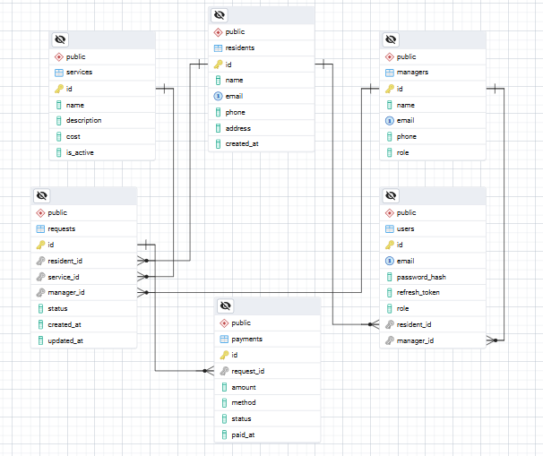

# 📘 Housing Services Portal Documentation

## Table of Contents

1. [Overview](#1-overview)
2. Setup & Installation
3. [Authentication](#3-authentication)
   - [Register](#register)
   - [Login](#login)
4. System Summary
5. [Data Modeling](#5-data-modeling)
   - [Entity Relationship Diagram](#entity-relationship-diagram)
   - [Detailed Table Information](#detailed-table-information)
   - [Relationships Explained](#relationships-explained)
6. API Endpoints
   - Residents Overview (`/api/residents`)
   - Services Overview (`/api/services`)
   - Requests Overview (`/api/requests`)
   - Housing Plans Overview (`/api/housing-plans`)
7. Cost Calculation Logic

---

## 1. Overview

The **Housing Services Portal** is an online platform designed to facilitate housing-related service requests for residents. Its primary goal is to streamline communication between residents and housing management while ensuring transparency around service availability and costs.

### 🎯 Purpose

- Allow residents to browse and request housing-related services (e.g., plumbing, maintenance, pest control).
- Inform users whether the service is covered under their housing fee or incurs an additional cost.
- Provide clear cost breakdowns when applicable.
- Offer administrators tools to manage services, pricing, and housing package inclusions.

---

## 3. Authentication

The portal uses a **JWT-based authentication system**. Users can register with an email and password, then login to receive a token for accessing protected endpoints.

### Register

**Endpoint:** `POST /api/auth/register`

**Request Body:**

```json
{
  "email": "user@example.com",
  "password": "securePassword123"
}
```

**Response:**

- `201 Created` on success

```json
{
  "message": "User registered"
}
```

- `400 Bad Request` if email or password missing or user already exists

### Login

**Endpoint:** `POST /api/auth/login`

**Request Body:**

```json
{
  "email": "user@example.com",
  "password": "securePassword123"
}
```

**Response:**

- `200 OK` on success

```json
{
  "token": "JWT_TOKEN_HERE"
}
```

- `401 Unauthorized` if credentials are invalid

---

## 5. Data Modeling

### Entity Relationship Diagram



### Detailed Table Information

### `Residents` Table

| Column     | Type     | Constraints        | Description                       |
| ---------- | -------- | ------------------ | --------------------------------- |
| id         | int      | PK, auto-increment | Unique identifier of the resident |
| name       | varchar  |                    | Full name of the resident         |
| email      | varchar  | Unique             | Resident's email address          |
| phone      | varchar  |                    | Resident's phone number           |
| address    | text     |                    | Resident's home address           |
| created_at | datetime |                    | Timestamp of record creation      |

### `Services` Table

| Column      | Type    | Constraints        | Description                      |
| ----------- | ------- | ------------------ | -------------------------------- |
| id          | int     | PK, auto-increment | Unique identifier of the service |
| name        | varchar |                    | Name of the service              |
| description | text    |                    | Description of the service       |
| cost        | decimal |                    | Service cost                     |
| is_active   | boolean |                    | Whether the service is active    |

### `Requests` Table

| Column      | Type     | Constraints        | Description                       |
| ----------- | -------- | ------------------ | --------------------------------- |
| id          | int      | PK, auto-increment | Unique identifier of the request  |
| resident_id | int      | FK → Residents.id  | The resident who made the request |
| service_id  | int      | FK → Services.id   | Service being requested           |
| manager_id  | int      | FK → Managers.id   | Manager assigned to the request   |
| status      | enum     | request_status     | Status of the request             |
| created_at  | datetime |                    | Timestamp of request creation     |
| updated_at  | datetime |                    | Timestamp of last update          |

### `Payments` Table

| Column     | Type     | Constraints        | Description                       |
| ---------- | -------- | ------------------ | --------------------------------- |
| id         | int      | PK, auto-increment | Unique payment identifier         |
| request_id | int      | FK → Requests.id   | Associated request                |
| amount     | decimal  |                    | Payment amount                    |
| method     | enum     | payment_method     | Payment method (card/cash/online) |
| status     | enum     | payment_status     | Payment status                    |
| paid_at    | datetime |                    | Timestamp of payment              |

### `Managers` Table

| Column | Type    | Constraints        | Description                                    |
| ------ | ------- | ------------------ | ---------------------------------------------- |
| id     | int     | PK, auto-increment | Unique identifier of the manager               |
| name   | varchar |                    | Manager's full name                            |
| email  | varchar | Unique             | Manager's email address                        |
| phone  | varchar |                    | Manager's phone number                         |
| role   | enum    | manager_role       | Role of the manager (admin/technician/support) |

### Enums

#### `request_status`

- pending
- in_progress
- completed
- cancelled

#### `payment_method`

- card
- cash
- online

#### `payment_status`

- paid
- pending
- failed

#### `manager_role`

- admin
- technician
- support

### Relationships Explained

- **Residents → Requests:** One-to-Many  
  _A resident can make many requests, but each request belongs to only one resident._

- **Services → Requests:** One-to-Many  
  _A service can be requested multiple times, but each request is for a single service._

- **Managers → Requests:** One-to-Many  
  _A manager can be assigned to multiple requests, but each request has only one manager._

- **Requests → Payments:** One-to-Many  
  _Each request can have multiple associated payments, and each payment belongs to a single request._

---
